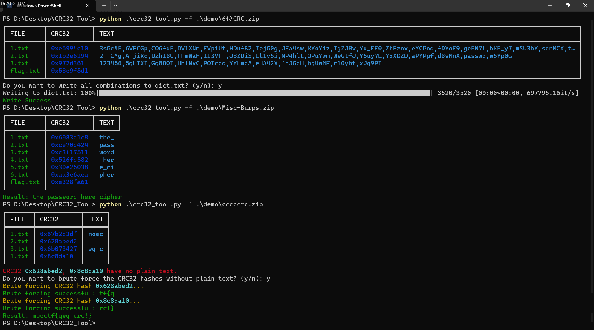

# CRC32-Tool

> CRC32 Tool，一个可以帮你自动化碰撞CRC32的工具。

## 功能

项目主要基于theonlypwner/crc32，同时增加了一些其他功能

- 自动读取压缩包并碰撞 `1-6` 位 CRC32
- 针对 `6` 位 CRC32 自动生成所有组合

## 如何使用

```
python3 crc32_tool.py -f <filename>
```


